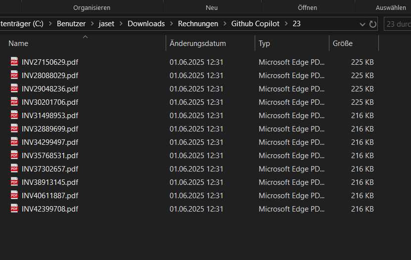
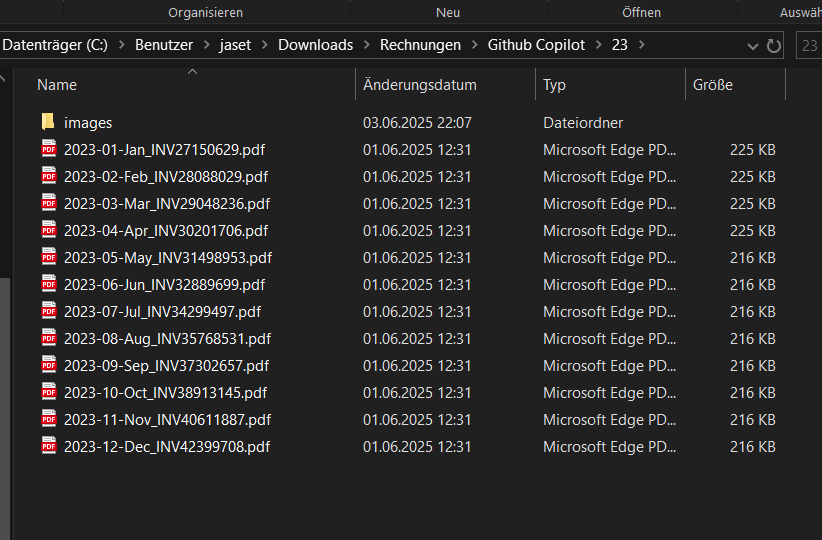
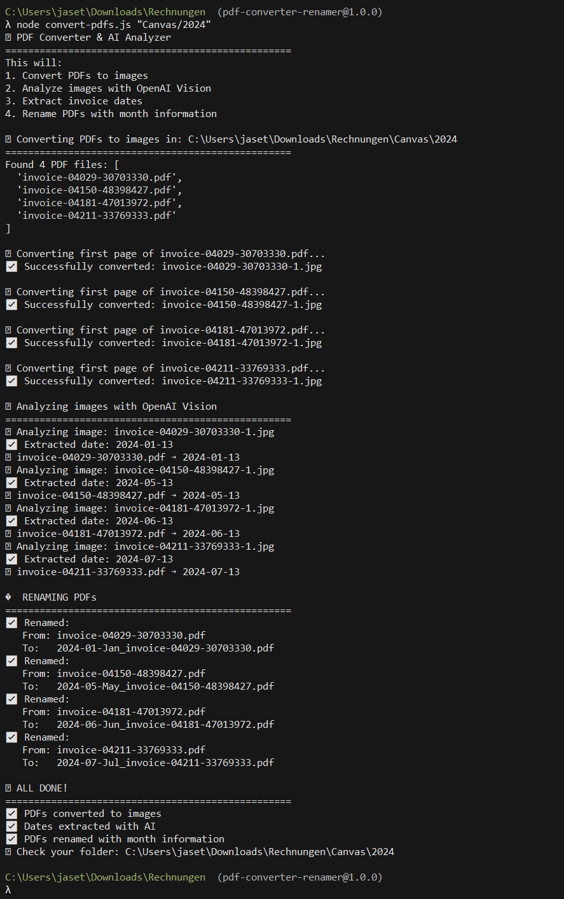

# 📄 Smart PDF Invoice Organizer

**Automatically convert, analyze, and rename PDF invoices with AI-powered date extraction**

Transform your messy invoice files from cryptic names like `694c1fcd-70cb-4346-a23d-1ab6bdcdd0fd.pdf` into organized, searchable files like `2023-07-Jul_694c1fcd-70cb-4346-a23d-1ab6bdcdd0fd.pdf` - completely automatically!

## ✨ Features

- 🔄 **PDF to Image Conversion**: Converts first page of PDFs to high-quality JPEG images
- 🤖 **AI-Powered Date Extraction**: Uses OpenAI GPT-4o-mini Vision to read and extract invoice dates
- 🏷️ **Smart Renaming**: Automatically renames files with `YYYY-MM-Month_originalname.pdf` format
- 📁 **Batch Processing**: Process entire directories of invoices at once
- 🌍 **Multi-language Support**: Works with invoices in multiple languages (English, German, etc.)
- ⚡ **Fast & Reliable**: Processes dozens of files efficiently with rate limiting
- 💰 **Cost-Effective**: Uses GPT-4o-mini for affordable AI processing

## 🖼️ Screenshots

### Before: Messy Invoice Filenames

*Invoices with cryptic, unsearchable filenames*

### After: Organized with Dates

*Same invoices now organized chronologically with readable dates*

### Terminal Output During Processing

*Real-time processing showing conversion, AI analysis, and renaming*

## 🚀 How It Works

1. **Convert**: Transforms PDF first pages into JPEG images
2. **Analyze**: Sends images to OpenAI Vision API to extract invoice dates
3. **Rename**: Automatically renames PDFs with extracted date information

The tool looks for common date indicators like "Invoice Date:", "Date:", "Datum:", "Rechnungsdatum:" and intelligently extracts the correct billing date (not due dates or other dates).

## 📋 Prerequisites

- Node.js (v14 or higher)
- OpenAI API key ([Get one here](https://platform.openai.com/api-keys))

## 🛠️ Installation

1. **Clone the repository**
   ```bash
   git clone https://github.com/sgeier/pdf-invoice-renamer.git
   cd pdf-invoice-renamer
   ```

2. **Install dependencies**
   ```bash
   npm install
   ```

3. **Set up your OpenAI API key**
   
   **Copy the environment template:**
   ```bash
   # Copy the example file
   cp env.example .env
   
   # Windows
   copy env.example .env
   ```
   
   **Edit the .env file:**
   Open `.env` and replace `your-openai-api-key-here` with your actual OpenAI API key:
   ```
   OPENAI_API_KEY=sk-your-actual-api-key-here
   ```
   
   **Get your API key**: Visit [OpenAI API Keys](https://platform.openai.com/api-keys) to create one.
   
   **Alternative - Use the setup script (Windows):**
   ```bash
   setup-env.bat
   ```
   This will guide you through creating the .env file interactively.

## 🎯 Usage

### Single Directory Processing
```bash
node convert-pdfs.js "path/to/invoice/folder"
```

### Multiple Files in One Directory
The script processes all PDF files in the specified directory:
```bash
node convert-pdfs.js "path/to/invoice/folder"
```

### Mode Options
```bash
# Full automatic processing (default)
node convert-pdfs.js "folder" auto

# Convert to images only
node convert-pdfs.js "folder" convert

# Rename with provided dates
node convert-pdfs.js "folder" rename '{"file1.pdf":"2024-03-15"}'
```

## 📊 Example Results

| Original Filename | Extracted Date | New Filename |
|-------------------|----------------|--------------|
| `694c1fcd-70cb-4346-a23d-1ab6bdcdd0fd.pdf` | July 2, 2023 | `2023-07-Jul_694c1fcd-70cb-4346-a23d-1ab6bdcdd0fd.pdf` |
| `invoice-04029-30703330.pdf` | March 15, 2024 | `2024-03-Mar_invoice-04029-30703330.pdf` |
| `Made_With_AI_164359013.pdf` | January 8, 2023 | `2023-01-Jan_Made_With_AI_164359013.pdf` |

## 🏗️ Project Structure

```
pdf-invoice-renamer/
├── convert-pdfs.js          # Main script
├── setup-env.bat           # API key setup helper (Windows)
├── env.example             # Environment template
├── .env                    # Your API key (create from env.example)
├── package.json            # Dependencies
└── README.md               # This file
```

## ⚙️ Configuration

The script automatically creates an `images/` folder in each processed directory containing the converted JPEG files for reference.

### Supported Date Formats
- `Invoice Date: March 15, 2024`
- `Date: 15.03.2024`
- `Datum: 15.03.2024`
- `Rechnungsdatum: 15.03.2024`
- And many other common formats

### File Naming Convention
`YYYY-MM-Month_originalfilename.pdf`
- `YYYY`: 4-digit year
- `MM`: 2-digit month (01-12)
- `Month`: 3-letter month abbreviation (Jan, Feb, Mar, etc.)

## 💡 Use Cases

- **Personal Finance**: Organize personal invoices from various services
- **Small Business**: Manage vendor invoices and receipts
- **Accounting**: Prepare invoice files for bookkeeping software
- **Tax Preparation**: Chronologically organize tax-relevant documents
- **Digital Archiving**: Convert legacy invoice systems to organized format

## 🔒 Privacy & Security

- **Local Processing**: PDF conversion happens locally on your machine
- **Secure API**: Only image data is sent to OpenAI for date extraction
- **No Data Storage**: OpenAI doesn't store the processed images
- **API Key Security**: Your API key is stored in `.env` file (automatically ignored by git)
- **Never commit your .env file**: The `.env` file is gitignored to prevent accidental API key exposure

## 💰 Cost Estimation

Using GPT-4o-mini Vision API:
- **~$0.00015 per image** (very affordable)
- **100 invoices ≈ $0.015** (less than 2 cents)
- **1000 invoices ≈ $0.15** (15 cents)

## 🤝 Contributing

Contributions are welcome! Feel free to:
- Report bugs
- Suggest new features
- Submit pull requests
- Improve documentation

## 📝 License

This project is licensed under the MIT License - see the [LICENSE](LICENSE) file for details.

## 🙏 Acknowledgments

- [pdf-poppler](https://www.npmjs.com/package/pdf-poppler) for reliable PDF to image conversion
- [OpenAI](https://openai.com/) for powerful vision AI capabilities
- All contributors and users of this tool

## 📞 Support

If you encounter any issues or have questions:
1. Check the existing [Issues](https://github.com/sgeier/pdf-invoice-renamer/issues)
2. Create a new issue with details about your problem
3. Include your OS, Node.js version, and error messages

---

**⭐ Star this repository if it helped you organize your invoices!** 