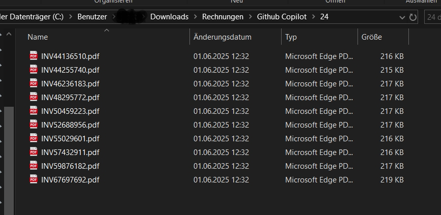
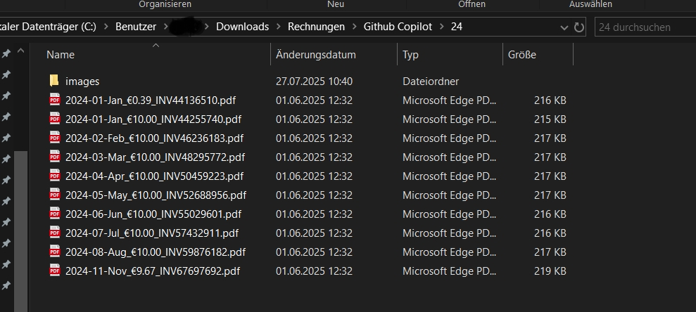

# 📄 Smart PDF Invoice Organizer

**Automatically convert, analyze, and rename PDF invoices with AI-powered date and price extraction**

Transform your messy invoice files from cryptic names like `694c1fcd-70cb-4346-a23d-1ab6bdcdd0fd.pdf` into organized, searchable files like `2023-07-Jul_€29.99_694c1fcd-70cb-4346-a23d-1ab6bdcdd0fd.pdf` - completely automatically!

## ✨ Features

- 🔄 **PDF to Image Conversion**: Converts first page of PDFs to high-quality JPEG images
- 🤖 **AI-Powered Data Extraction**: Uses OpenAI GPT-4o-mini to extract invoice dates, vendors, AND total prices
- 🏢 **Vendor Detection**: Automatically identifies the company/vendor that issued the invoice
- 💰 **Smart Price Detection**: Automatically identifies final total amounts including taxes and fees
- 🏷️ **Enhanced Renaming**: Automatically renames files with `YYYY-MM-Month_VendorName_€XX.XX_originalname.pdf` format
- 📁 **Batch Processing**: Process entire directories of invoices at once
- 📂 **Auto-Organization**: Organize renamed invoices into year/month/vendor folder structure
- 🌍 **Multi-language Support**: Works with invoices in multiple languages (English, German, etc.)
- ⚡ **Fast & Reliable**: Processes dozens of files efficiently with rate limiting
- 💰 **Cost-Effective**: Uses GPT-4o-mini for affordable AI processing
- 🔍 **Easy Searching**: Find invoices by vendor, price range, date, or month instantly

## 🖼️ Screenshots

### Before: Messy Invoice Filenames

*Invoices with cryptic, unsearchable filenames like `30334927000901.pdf`*

### After: Organized with Dates AND Prices

*Invoices now renamed for instant clarity: `2023-02-Feb_€48.97_30334927000901.pdf`*

### Terminal Output During Processing

*Real-time processing showing conversion, AI analysis, and renaming with both dates and prices*

## 🚀 How It Works

1. **Convert**: Transforms PDF first pages into JPEG images
2. **Analyze**: Sends images to OpenAI GPT-4o-mini to extract invoice dates, vendors, AND total amounts
3. **Rename**: Automatically renames PDFs with extracted information in the format `YYYY-MM-Month_VendorName_€XX.XX_originalfilename.pdf`
4. **Organize** (optional): Sort renamed invoices into structured folders: `invoices/year/month/vendor/`

The tool intelligently identifies:
- **Invoice dates**: Billing/invoice dates (not due dates or other irrelevant dates)
- **Vendor names**: Company or brand that issued the invoice (e.g., "Anthropic", "Vodafone", "OpenAI")
- **Total amounts**: Final amounts to be paid including all taxes and fees (not subtotals or line items)

*Uses OpenAI GPT-4o-mini for both date and price extraction from images*

## 📋 Prerequisites

- Node.js (v14 or higher)
- OpenAI API key ([Get one here](https://platform.openai.com/api-keys))

## 🛠️ Installation

1. **Clone the repository**
   ```bash
   git clone https://github.com/sgeier/pdf-invoice-renamer.git
   cd pdf-invoice-renamer
   ```

2. **Install dependencies**
   ```bash
   npm install
   ```

3. **Set up your OpenAI API key**
   
   **Copy the environment template:**
   ```bash
   # Copy the example file
   cp env.example .env
   
   # Windows
   copy env.example .env
   ```
   
   **Edit the .env file:**
   Open `.env` and replace `your-openai-api-key-here` with your actual OpenAI API key:
   ```
   OPENAI_API_KEY=sk-your-actual-api-key-here
   ```
   
   **Get your API key**: Visit [OpenAI API Keys](https://platform.openai.com/api-keys) to create one.
   
   **Alternative - Use the setup script (Windows):**
   ```bash
   setup-env.bat
   ```
   This will guide you through creating the .env file interactively, including entering your API key.

## 🎯 Usage

### Step 1: Parse and Rename Invoices

Process all PDF files in a directory:
```bash
node convert-pdfs.js "path/to/invoice/folder"
```

This will:
- Convert PDFs to images
- Extract date, vendor, and total amount
- Rename files to: `YYYY-MM-Month_VendorName_€XX.XX_originalname.pdf`

### Step 2: Organize Into Folders (Optional)

After renaming, organize invoices into structured folders:
```bash
node organize-invoices.js "path/to/invoice/folder"
```

This creates the structure:
```
invoices/
├── 2025/
│   ├── 10/
│   │   ├── Anthropic/
│   │   │   └── 2025-10-Oct_Anthropic_€142.50_invoice.pdf
│   │   └── Vodafone/
│   │       └── 2025-10-Oct_Vodafone_€49.99_bill.pdf
│   └── 11/
│       └── OpenAI/
│           └── 2025-11-Nov_OpenAI_€20.00_receipt.pdf
```

### Advanced: Specify Custom Output Folder
```bash
node organize-invoices.js "./downloads" "./my-invoices"
```

### Mode Options (convert-pdfs.js)
```bash
# Full automatic processing (default) - extracts dates, vendors, AND prices
node convert-pdfs.js "folder" auto

# Convert to images only
node convert-pdfs.js "folder" convert

# Rename with provided data (legacy mode)
node convert-pdfs.js "folder" rename '{"file1.pdf":{"date":"2024-03-15","vendor":"Anthropic","total":"29.99"}}'
```

## 📊 Example Results

| Original Filename | Date | Vendor | Price | New Filename |
|-------------------|------|--------|-------|--------------|
| `694c1fcd-70cb-4346-a23d-1ab6bdcdd0fd.pdf` | July 2, 2023 | Midjourney | €29.99 | `2023-07-Jul_Midjourney_€29.99_694c1fcd-70cb-4346-a23d-1ab6bdcdd0fd.pdf` |
| `invoice-04029-30703330.pdf` | March 15, 2024 | Anthropic | €156.80 | `2024-03-Mar_Anthropic_€156.80_invoice-04029-30703330.pdf` |
| `Made_With_AI_164359013.pdf` | January 8, 2023 | OpenAI | €11.99 | `2023-01-Jan_OpenAI_€11.99_Made_With_AI_164359013.pdf` |

### Real-World Example from Google Invoices:
```
Before: "1079562573546578-33.pdf"
After:  "2022-07-Jul_Google_€11.99_1079562573546578-33.pdf"

Before: "619935639187-228.pdf" 
After:  "2022-03-Mar_Google_€36.99_619935639187-228.pdf"
```

### After Organization:
```
invoices/
├── 2022/
│   ├── 03/
│   │   └── Google/
│   │       └── 2022-03-Mar_Google_€36.99_619935639187-228.pdf
│   └── 07/
│       └── Google/
│           └── 2022-07-Jul_Google_€11.99_1079562573546578-33.pdf
```

## 🔍 Search Benefits

With the new naming format and folder structure, you can easily:
- **Find by vendor**: Search for "Anthropic" to find all invoices from that company
- **Find expensive invoices**: Search for "€1" to find invoices over €100
- **Find by price range**: Search "€2.99" to find cheap subscriptions
- **Browse by date**: Navigate to specific year/month folders
- **Sort by amount**: Files naturally sort by date, but you can also filter by price
- **Track spending**: Quickly see how much you spent with each vendor per month
- **Tax preparation**: Easily gather all invoices from a specific vendor or time period

## 🏗️ Project Structure

```
pdf-invoice-renamer/
├── convert-pdfs.js          # Main script: extract date/vendor/price & rename
├── organize-invoices.js     # Organization script: sort into folders
├── setup-env.bat           # API key setup helper (Windows)
├── env.example             # Environment template
├── .env                    # Your API key (create from env.example)
├── package.json            # Dependencies
└── README.md               # This file
```

## ⚙️ Configuration

The script automatically creates an `images/` folder in each processed directory containing the converted JPEG files for reference.

### Supported Data Extraction
**Dates**: The AI automatically identifies invoice/billing dates in various formats and languages
**Prices**: The AI finds the final total amount including taxes and fees, ignoring subtotals

### File Naming Convention
`YYYY-MM-Month_VendorName_€XX.XX_originalfilename.pdf`
- `YYYY`: 4-digit year
- `MM`: 2-digit month (01-12)
- `Month`: 3-letter month abbreviation (Jan, Feb, Mar, etc.)
- `VendorName`: Company/brand name (cleaned, max 30 chars)
- `€XX.XX`: Total amount with 2 decimal places
- Partial formats supported if some data is missing

**Examples:**
- Before: `30334927000901.pdf`
- After:  `2023-02-Feb_Vodafone_€48.97_30334927000901.pdf`

**Folder Organization:**
```
invoices/
└── YYYY/           (year)
    └── MM/         (month)
        └── Vendor/ (company name)
            └── [invoice files]
```

## 💡 Use Cases

- **Personal Finance**: Organize personal invoices with amounts for budget tracking
- **Small Business**: Manage vendor invoices with totals for expense reports
- **Accounting**: Prepare invoice files with amounts for bookkeeping software
- **Tax Preparation**: Chronologically organize tax-relevant documents with amounts
- **Digital Archiving**: Convert legacy invoice systems to organized format with pricing data
- **Expense Tracking**: Quickly identify high-value transactions or recurring costs

## 🔒 Privacy & Security

- **Local Processing**: PDF conversion happens locally on your machine
- **Secure API**: Only image data is sent to OpenAI for date and price extraction
- **No Data Storage**: OpenAI doesn't store the processed images
- **API Key Security**: Your API key is stored in `.env` file (automatically ignored by git)
- **Never commit your .env file**: The `.env` file is gitignored to prevent accidental API key exposure

## 💰 Cost Estimation

Using GPT-4o-mini Vision API:
- **~$0.00015 per image** (very affordable)
- **100 invoices ≈ $0.015** (less than 2 cents)
- **1000 invoices ≈ $0.15** (15 cents)

*Even with the enhanced price extraction, costs remain the same as we use a single API call per invoice.*

## 🤝 Contributing

Contributions are welcome! Feel free to:
- Report bugs
- Suggest new features (like currency detection, tax extraction, etc.)
- Submit pull requests
- Improve documentation

## 📝 License

This project is licensed under the MIT License - see the [LICENSE](LICENSE) file for details.

## 🙏 Acknowledgments

- [pdf-poppler](https://www.npmjs.com/package/pdf-poppler) for reliable PDF to image conversion
- [OpenAI](https://openai.com/) for powerful vision AI capabilities that can extract both dates and prices
- All contributors and users of this tool

## 📞 Support

If you encounter any issues or have questions:
1. Check the existing [Issues](https://github.com/sgeier/pdf-invoice-renamer/issues)
2. Create a new issue with details about your problem
3. Include your OS, Node.js version, and error messages

---

**⭐ Star this repository if it helped you organize your invoices with dates AND prices!** 

**Notes:**
- This project uses [OpenAI GPT-4o-mini](https://platform.openai.com/docs/models/gpt-4o) for image understanding and extraction. Filenames always include both the month and the price for maximum searchability and clarity. 